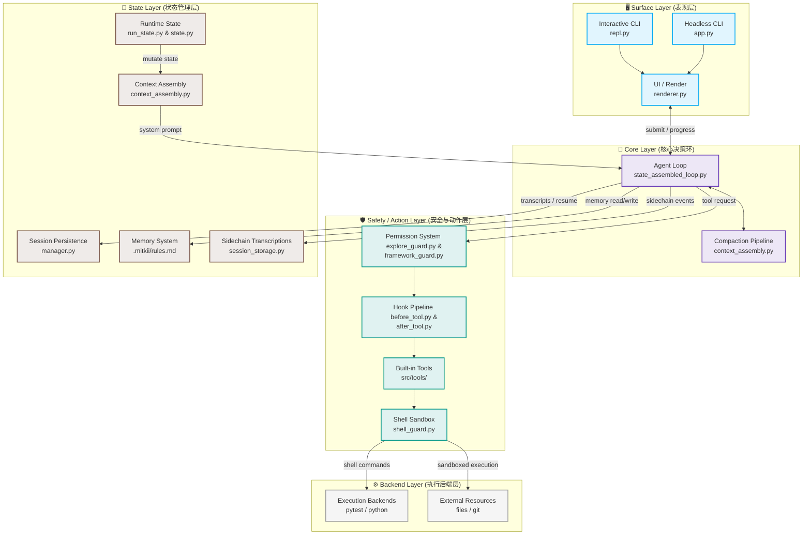

# MitKII — AI Code Agent (智能编码代理与 Harness 引擎)

MitKII 是一款终端驱动的、具备高度自主能力的 AI 编码代理（Code Agent）。它允许你使用自然语言描述复杂的开发和调试需求，由 Agent 自主进行代码搜索、理解、编辑、测试运行以及自我验证修剪。

类似 Aider 或 Claude Code，但 MitKII 拥有更具确定性的底层 **Harness 引擎**，提供沙箱指令执行、版本自动快照快退（Checkpoint）、基于 AST & SQL 视图的语义校验门控，以及智能 Token 预算修剪。

---

## 🏗️ 架构概览 (Architecture Overview)

MitKII 的系统架构可以清晰地划分为五大协同层次。以下是系统整体数据流与组件关系拓扑图（可在 GitHub 直接渲染渲染）：



---

## 🧩 核心模块详解 (5-Layer Modular Breakdown)

### 1. Surface Layer (表现层)
表现层负责与用户或外部程序交互，捕获指令与中断请求，并将 Agent 执行状态以高保真视觉效果渲染出来。
- **`repl.py` (Interactive CLI)**: 基于 `prompt_toolkit` 提供交互式命令行 Shell，支持命令自动补全、换行连接、多行输入及旋转的圆点加载动画（Dots Spinner）。
- **`renderer.py` & `theme.py` (UI / Render)**: 负责在终端中以和谐、高保真色彩的 Rich 布局渲染 Agent 计划、执行路径、评估结果。
- **`app.py` (Headless CLI / Entry)**: CLI 核心入口。内置交互式配置向导，首次启动时引导用户极速配置 API Key 并输出 `.env`。

### 2. Core Layer (核心决策环)
核心层是 Agent 大脑，通过状态环不断循环生成计划、挑选工具并进行上下文整理。
- **`state_assembled_loop.py` (Agent Loop)**: 核心决策环。负责驱动检索（Retrieval）与编辑（Edit）的解耦协同。
- **`context_assembly.py` (Compaction Pipeline)**: 负责整理和压缩输入上下文，进行冗余空行缩减及 Skeleton AST 结构折叠，保证 Token 预算健康。

### 3. Safety / Action Layer (安全与动作层)
安全层拦截并过滤危险指令，动作层包含了被调度的各种独立内置工具（包括 RAG 检索引擎）。
- **`explore_guard.py` & `framework_guard.py` (Permission System)**: 危险操作与白名单安全分类器。
- **`before_tool.py` & `after_tool.py` (Hook Pipeline)**: 工具运行拦截器。拦截越界调用、强制 Fact Locking 锁定。
- **`src/tools/` (Built-in Tools)**:
  - **`decision_edit.py`**: 编辑工具。利用流式 JSON 解析实时向表现层输出新增/删除行数变化进度 `[+A -R]`。
  - **`codebase_retrieve.py` / `retriever.py`**: 召回主引擎。调度 `graph_bridge.py`（AST 视图拓扑关联）、`reranker.py`（硅基流精排模型）及 `fusion.py`（RRF 融合去重算法）召回最强关联上下文。
- **`shell_guard.py` (Shell Sandbox)**: 限制并隔离 Shell 命令的执行范围。

### 4. Backend Layer (执行后端层)
后端层是物理层，提供命令执行物理沙箱及文件 IO、Git 存储等外部资源交互。
- **Execution Backends**: 包括沙箱内的 Python 解释器、运行单元测试的 pytest 引擎。
- **External Resources**: 文件系统读写读入、Git 版本历史树变更等外部资源。

### 5. State Layer (状态管理层)
状态层持久化并跟踪整个生命周期的演进，包括长短期记忆与多线程侧链录音。
- **`run_state.py` & `state.py` (Runtime State)**: 基于 Reducer 式的流式状态转换。
- **`context_assembly.py` (Context Assembly)**: 根据最新状态拼装 System Prompt 并投喂给 Core Layer。
- **`manager.py` (Session Persistence)**: 保存 Patch 记忆、执行痕迹（Execution Trace）并支持 Checkpoint 快照秒级回滚。
- **`.mitkii/rules.md` (Memory System)**: 储存项目规约和用户指令记忆。
- **`session_storage.py` (Sidechain Transcriptions)**: 副链日志与大模型多轮 Transcript 事件录音存储。

---

## ⚡ 极速开始 (Getting Started)

### 本地开发运行
1. **安装环境依赖**
   ```bash
   git clone https://github.com/yourname/harness-mitkii.git
   cd harness-mitkii
   pip install -e .
   ```
2. **初始化并启动目标项目**
   ```bash
   # 进入你需要让 Agent 开发或修复的目标项目目录
   cd /path/to/your/target-project

   # 初始化代码库索引
   mitkii init

   # 开启智能编码对话（若无 .env 配置会自动进入交互式配置向导）
   mitkii chat
   ```
3. **运行测试套件**
   ```bash
   # 在 mitkii 源码目录下运行自测
   pytest
   ```

---

## 🏷️ 开源许可证
本项目基于 **MIT License** 许可分发。
