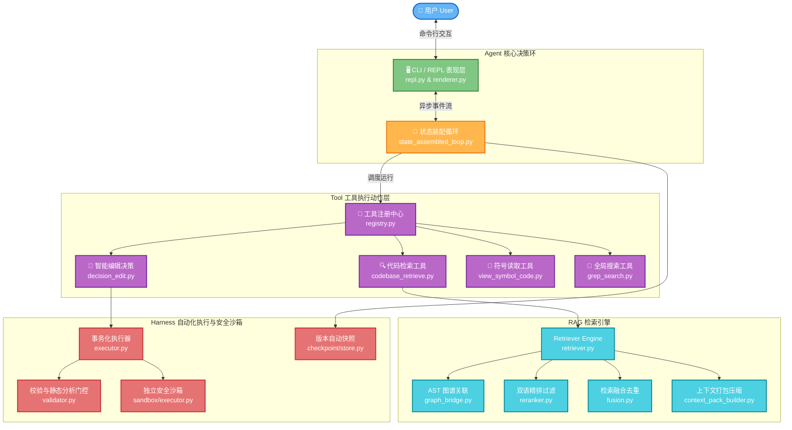

# MitKII — AI Code Agent (智能编码代理与 Harness 引擎)

MitKII 是一款终端驱动的、具备高度自主能力的 AI 编码代理（Code Agent）。它允许你使用自然语言描述复杂的开发和调试需求，由 Agent 自主进行代码搜索、理解、编辑、测试运行以及自我验证修剪。

类似 Aider 或 Claude Code，但 MitKII 拥有更具确定性的底层 **Harness 引擎**，提供沙箱指令执行、版本自动快照快退（Checkpoint）、基于 AST & SQL 视图的语义校验门控，以及智能 Token 预算修剪。

---

## 🏗️ 架构概览 (Architecture Overview)

MitKII 的系统架构可以清晰地划分为五大协同层次。以下是系统整体数据流与组件关系拓扑图（可在 GitHub 直接渲染渲染）：



---

## 🧩 核心模块详解

### 1. CLI / REPL 表现层 (`src/cli/`)
- **`repl.py`**: 提供交互式命令 Shell，支持输入历史、多行换行连接、快捷斜杠命令（`/serve` `/history` `/probe` `/score`）。它内部采用 `rich.status` 启动旋转的动态圆点加载动画（Dots Spinner），完美与底层的状态改变事件（Status Event）进行管道互通。
- **`renderer.py` & `theme.py`**: 基于 Harmonious 暗色和高对比度 HSL 配色方案，将 Agent 执行计划、Tool 调用痕迹、评分结果以极其 premium 的高保真终端视觉呈现。
- **配置向导**: 首次无 `.env` 启动时，自动触发向导，引导交互式填写 API 密钥及 SiliconFlow 服务商地址，就地生成环境配置，实现开箱即用。

### 2. 状态装配决策环 (`src/agent/`)
- **`state_assembled_loop.py`**: Agent 运行的最外层状态机。负责把检索阶段与编辑阶段彻底解耦。
- **`reallocate_tools.py`**: 动态工具调整 Hook。在检索证据达到饱和（决策重力衰减）或已经形成修改 plan 时，自动缩减工具集为仅 `decision_edit`，以强迫 Agent 收敛到编辑状态，杜绝冗余读取带来的 Token 费用和首字延迟。
- **`run_state.py`**: 定义了 Reducer 式的状态转换机制，每一次事件输入生成纯净的状态投影。

### 3. 工具装配层 (`src/tools/`)
- **`decision_edit.py`**: 负责调用 LLM 将修改意图转化为 `SEARCH/REPLACE` 代码片段，采用 **Stream 流式流出解析器**。在吐出补丁文本的同时实时统计 `+` 和 `-` 行数，通过回调反馈给外层 REPL，使终端的 Loading 转圈能实时刷新出类似 `正在编辑文件: list.py… [+3 -2]` 的进度。
- **`codebase_retrieve.py`**: 高级代码语义/AST 拓扑/全库索引检索工具。

### 4. RAG 检索引擎 (`src/tools/assembled/`)
- **`retriever.py`**: 协调多维度召回核心。
- **`graph_bridge.py` & `query_bridge.py`**: 利用 Tree-sitter AST 解析和 SQL 视图的元数据图谱（Schema & Tables），建立引用和定义关联。在处理 SQL 复杂嵌套查询时，会自动对表结构与视图别名进行上下文追溯。
- **`fusion.py`**: 多模检索结果合并，采用互易倒数排名（RRF）融合算法，并智能拦截已经检索过的重复片段。
- **`reranker.py`**: 支持加载 SiliconFlow 等远程重排模型，筛选出最直接相关的 Top-N 高价值上下文。
- **`context_pack_builder.py`**: 在保证信息完整性的基础上，自动进行冗余空行折叠、代码骨架化截断（Skeleton Truncation），将拼装好的上下文以最小体积塞入 Core LLM 的 Context Window。

### 5. Harness 执行沙箱与校验层 (`src/tools/assembled/`)
- **`executor.py`**: 事务级修改应用器。负责保存被编辑文件的原内容备份，生成临时补丁，并处理可能的物理修改失败。
- **`validator.py`**: 核心门控校验器。
  - **动态测试剪枝 (Impact Analysis)**：基于编辑的文件路径，自动去 `tests/` 下寻找对应 `test_<filename>.py` 同名测试文件。如果命中，pytest 只运行该测试子集，将常规的 30s 自动化校验延迟压缩至 2s 内。
  - **SQL 别名追踪与 Schema 校验**：实现 `mtime` 时间戳缓存的 `_VIEW_SCHEMA_CACHE`。若 SQL 或 py 文件没有发生修改，直接走内存读取解析，使大规模视图关联追踪降至几毫秒。

---

## ⚡ 极速开始 (Getting Started)

### 本地开发运行
1. **安装环境依赖**
   ```bash
   git clone https://github.com/yourname/harness-mitkii.git
   cd harness-mitkii
   pip install -e .
   ```
2. **初始化并启动目标项目**
   ```bash
   # 进入你需要让 Agent 开发或修复的目标项目目录
   cd /path/to/your/target-project

   # 初始化代码库索引
   mitkii init

   # 开启智能编码对话（若无 .env 配置会自动进入交互式配置向导）
   mitkii chat
   ```
3. **运行测试套件**
   ```bash
   # 在 mitkii 源码目录下运行自测
   pytest
   ```

---

## 🏷️ 开源许可证
本项目基于 **MIT License** 许可分发。
